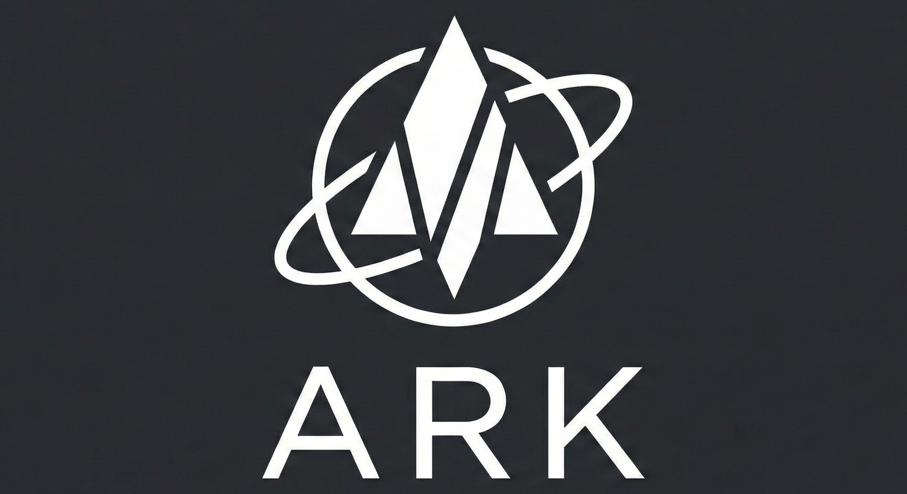

<div align="center">



<h1>ARK - Advanced Rocketry Kernel</h1>

<h3>Professional Flight Computer Firmware for Model Rocketry</h3>

<p>
  
  
  
  
</p>

<p><em>State-of-the-art flight computer firmware for autonomous rocket flight management</em></p>

<p>
  <a href="#features">Features</a> •
  <a href="#installation">Installation</a> •
  <a href="#quick-start">Quick Start</a> •
  <a href="#flight-states">Flight States</a> •
  <a href="#contributing">Contributing</a>
</p>

<hr/>


<p><strong>Developed by Team Ignition Software Department</strong><br/>
<em>Official Model Rocketry Team of Vellore Institute of Technology, Chennai</em></p>

</div>

---

## About

<table>
<tr>
<td width="60%">

**ARK (Advanced Rocketry Kernel)** is a professional-grade flight computer firmware designed for model rockets and experimental aerospace vehicles. Built with C++, it provides robust state machine management for all phases of rocket flight, from pre-launch initialization to landing and recovery.

Developed by Team Ignition's Software Department, ARK empowers rocketry teams with reliable, modular, and extensible flight control software that handles sensor integration, telemetry logging, and autonomous flight state transitions.

</td>
<td width="40%">

### Core Capabilities

<ul>
<li>11-state flight state machine</li>
<li>Modular sensor integration framework</li>
<li>Real-time telemetry data logging</li>
<li>Configurable threshold-based transitions</li>
<li>Failsafe and recovery modes</li>
<li>Hardware abstraction layer</li>
<li>Extensible architecture</li>
<li>Production-ready code structure</li>
</ul>

</td>
</tr>
</table>

---

## Features

<details open>
<summary><h3>🚀 Flight State Management</h3></summary>

<table>
<tr>
<td width="50%">

**Comprehensive State Machine**
- 11 distinct flight states
- Autonomous state transitions
- Threshold-based detection logic
- Failsafe handling
- State-specific behaviors
- Real-time state monitoring

**Supported Flight Phases**
- Boot and initialization
- Pre-launch idle
- Armed and ready
- Launch detection
- Powered ascent
- Coasting/cruising
- Apogee detection
- Parachute deployment
- Descent monitoring
- Landing detection
- Post-flight operations

</td>
<td width="50%">

**State Transition Logic**
- Acceleration-based launch detection (~1.5G threshold)
- Altitude-based apogee detection
- Velocity monitoring for phase transitions
- Time-based stability checks
- Multi-parameter validation
- Configurable thresholds

**Failsafe Features**
- Automatic failsafe state entry
- System health monitoring
- Sensor validation
- Recovery procedures
- Safe default behaviors

</td>
</tr>
</table>

</details>

<details>
<summary><h3>📡 Sensor Integration</h3></summary>

<table>
<tr>
<td width="50%">

**Sensor Framework**

The FlightSystem class provides a unified interface for sensor data acquisition:

- **Altitude Measurement**: Barometric pressure sensors
- **Acceleration**: 3-axis accelerometer (Z-axis primary)
- **Velocity**: Derived from sensor fusion
- **System Health**: Continuous sensor validation

**Hardware Abstraction**

- Modular sensor interface design
- Easy integration of new sensors
- Platform-independent sensor API
- Configurable sensor parameters

</td>
<td width="50%">

**Data Processing**

- Real-time sensor readings
- Data validation and filtering
- Sensor fusion algorithms (ready for implementation)
- Telemetry data packaging
- Logging and storage

**Supported Sensors** (Framework Ready)

- Barometric altimeters (BMP280, MS5611)
- IMU/Accelerometers (MPU6050, BNO055)
- GPS modules (NEO-6M, NEO-M8N)
- Temperature sensors
- Custom sensor integration support

</td>
</tr>
</table>

</details>

<details>
<summary><h3>⚙️ Configuration System</h3></summary>

<table>
<tr>
<td width="50%">

**Global Configuration**

All system parameters are centralized in `config.h`:

**Launch Detection**
- Acceleration threshold: 15.0 m/s² (~1.5G)
- Altitude threshold: 1.0 meter
- Configurable sensitivity

**Apogee Detection**
- Descent threshold: 1.0 meter drop
- Velocity-based confirmation
- Multi-parameter validation

</td>
<td width="50%">

**Landing Detection**
- Stability time: 5000 ms (5 seconds)
- Altitude noise tolerance: ±0.25 meters
- Prevents false positives

**System Timing**
- Main loop period: 10 ms (100 Hz)
- Non-blocking execution
- Deterministic timing

**Easy Customization**
- Single configuration file
- Well-documented parameters
- Unit-annotated values

</td>
</tr>
</table>

</details>

<details>
<summary><h3>📊 Data Logging & Telemetry</h3></summary>

<table>
<tr>
<td width="50%">

**Telemetry System**

- Real-time data logging via DataLogger
- Timestamped flight data
- Critical parameter recording
- Post-flight analysis support

**Logged Parameters**
- Altitude (meters)
- Velocity (m/s)
- Acceleration (m/s²)
- Flight state
- System health status
- Timestamps

</td>
<td width="50%">

**Data Management**

- Efficient data buffering
- Non-blocking writes
- Configurable logging rates
- Storage optimization

**Integration Ready**
- SD card logging support (framework)
- Serial telemetry output
- Ground station communication
- Real-time monitoring capability

</td>
</tr>
</table>

</details>

<details>
<summary><h3>🏗️ Modular Architecture</h3></summary>

<table>
<tr>
<td width="50%">

**Code Organization**

```
ARK/
├── main.cpp              # Entry point & state machine
├── main.h                # Main header
├── config.h              # Global configuration
├── Flight_Logic/
│   ├── flight_system.h   # System class header
│   ├── flight_system.cpp # System implementation
│   ├── flight_states.h   # State definitions
│   └── flight_states.cpp # State handlers
├── Flight_Sensors/       # Sensor drivers
├── Flight_Testing/       # Test utilities
└── User_Documentation/   # Documentation
```

</td>
<td width="50%">

**Design Principles**

- **Separation of Concerns**: Clear module boundaries
- **Encapsulation**: Class-based design
- **Extensibility**: Easy to add features
- **Maintainability**: Clean, documented code
- **Reusability**: Modular components

**Code Quality**

- Consistent coding standards
- Comprehensive file headers
- Version history tracking
- Doxygen-ready documentation
- Team collaboration support

</td>
</tr>
</table>

</details>

---

## Flight States

<div align="center">
<h3>11-State Flight State Machine</h3>
<p><em>Autonomous management of complete rocket flight lifecycle</em></p>
</div>

<table>
<tr>
<th width="20%">State</th>
<th width="40%">Description</th>
<th width="40%">Transition Conditions</th>
</tr>
<tr>
<td><strong>BOOT</strong></td>
<td>System initialization and health checks</td>
<td>System health OK → IDLE</td>
</tr>
<tr>
<td><strong>IDLE</strong></td>
<td>Pre-launch standby, awaiting arming</td>
<td>Arm command → ARMED</td>
</tr>
<tr>
<td><strong>ARMED</strong></td>
<td>Ready for launch, monitoring for liftoff</td>
<td>Launch detected → LAUNCH</td>
</tr>
<tr>
<td><strong>LAUNCH</strong></td>
<td>Liftoff detected, initial ascent phase</td>
<td>Acceleration > 15 m/s² AND Altitude > 1m → ASCENT</td>
</tr>
<tr>
<td><strong>ASCENT</strong></td>
<td>Powered flight, motor burning</td>
<td>Motor burnout detected → CRUISING</td>
</tr>
<tr>
<td><strong>CRUISING</strong></td>
<td>Coasting phase, unpowered ascent</td>
<td>Velocity ≈ 0 or descent detected → APOGEE</td>
</tr>
<tr>
<td><strong>APOGEE</strong></td>
<td>Peak altitude reached, preparing deployment</td>
<td>Altitude drop > 1m → DEPLOYMENT</td>
</tr>
<tr>
<td><strong>DEPLOYMENT</strong></td>
<td>Parachute/recovery system deployment</td>
<td>Deployment confirmed → DESCENT</td>
</tr>
<tr>
<td><strong>DESCENT</strong></td>
<td>Controlled descent under parachute</td>
<td>Stable altitude for 5s → LANDED</td>
</tr>
<tr>
<td><strong>LANDED</strong></td>
<td>Touchdown confirmed, post-flight mode</td>
<td>Remains in LANDED</td>
</tr>
<tr>
<td><strong>FAILSAFE</strong></td>
<td>Emergency mode for system errors</td>
<td>Remains in FAILSAFE</td>
</tr>
</table>

### State Machine Diagram

```
BOOT → IDLE → ARMED → LAUNCH → ASCENT → CRUISING → APOGEE
                                                        ↓
                                            LANDED ← DESCENT ← DEPLOYMENT
                                              
                                    FAILSAFE (can enter from any state)
```

---

## System Requirements

<table>
<tr>
<td width="50%">

### Hardware Requirements

<table>
<tr><th>Component</th><th>Specification</th></tr>
<tr><td>Microcontroller</td><td>ARM Cortex-M series or equivalent<br/>32-bit processor recommended</td></tr>
<tr><td>Flash Memory</td><td>Minimum 64 KB<br/>128 KB+ recommended</td></tr>
<tr><td>RAM</td><td>Minimum 8 KB<br/>16 KB+ recommended</td></tr>
<tr><td>Clock Speed</td><td>48 MHz or higher</td></tr>
<tr><td>Sensors</td><td>Barometric altimeter<br/>3-axis accelerometer<br/>Optional: GPS, gyroscope</td></tr>
</table>

</td>
<td width="50%">

### Software Requirements

<table>
<tr><th>Component</th><th>Requirement</th></tr>
<tr><td>Compiler</td><td>C++11 or higher<br/>GCC, Clang, or ARM compiler</td></tr>
<tr><td>Build System</td><td>Make, CMake, or PlatformIO</td></tr>
<tr><td>IDE (Optional)</td><td>Arduino IDE<br/>PlatformIO<br/>STM32CubeIDE<br/>Visual Studio Code</td></tr>
<tr><td>Libraries</td><td>Platform-specific HAL<br/>Sensor libraries as needed</td></tr>
</table>

### Tested Platforms

- Arduino-compatible boards
- STM32 microcontrollers
- ESP32 (with modifications)
- Teensy boards

</td>
</tr>
</table>

---

## Installation

<details open>
<summary><h3>Method 1: Clone Repository</h3></summary>

```bash
# Clone the repository
git clone https://github.com/teamignitionvitc/ARK-Advanced-Rocketry-Kernel-.git
cd ARK-Advanced-Rocketry-Kernel-

# Open in your preferred IDE
# Configure for your target platform
# Build and upload to microcontroller
```

</details>

<details>
<summary><h3>Method 2: Download ZIP</h3></summary>

1. Download ZIP from GitHub repository
2. Extract to your projects folder
3. Open in Arduino IDE or PlatformIO
4. Select your board and port
5. Compile and upload

</details>

### Platform-Specific Setup

<details>
<summary><h4>Arduino IDE</h4></summary>

1. Install Arduino IDE (1.8.x or 2.x)
2. Install required board support packages
3. Install sensor libraries:
   - Adafruit BMP280 (or equivalent)
   - Adafruit MPU6050 (or equivalent)
4. Open `main.cpp` in Arduino IDE
5. Select board and port
6. Click Upload

</details>

<details>
<summary><h4>PlatformIO</h4></summary>

1. Install PlatformIO (VS Code extension or CLI)
2. Create `platformio.ini` configuration:

```ini
[env:your_board]
platform = your_platform
board = your_board
framework = arduino
lib_deps = 
    adafruit/Adafruit BMP280 Library
    adafruit/Adafruit MPU6050
```

3. Build and upload:
```bash
pio run --target upload
```

</details>

<details>
<summary><h4>STM32CubeIDE</h4></summary>

1. Import project into STM32CubeIDE
2. Configure HAL for your STM32 board
3. Add sensor drivers to project
4. Build and flash to board

</details>

---

## Quick Start

<details open>
<summary><h3>1. Hardware Setup</h3></summary>

**Connect Sensors**

<table>
<tr>
<th>Sensor</th>
<th>Connection</th>
<th>Purpose</th>
</tr>
<tr>
<td>BMP280/MS5611</td>
<td>I2C (SDA, SCL)</td>
<td>Altitude measurement</td>
</tr>
<tr>
<td>MPU6050/BNO055</td>
<td>I2C (SDA, SCL)</td>
<td>Acceleration and orientation</td>
</tr>
<tr>
<td>GPS (Optional)</td>
<td>UART (TX, RX)</td>
<td>Position tracking</td>
</tr>
<tr>
<td>SD Card (Optional)</td>
<td>SPI</td>
<td>Data logging</td>
</tr>
</table>

**Power Supply**
- Stable 3.3V or 5V (depending on board)
- Battery backup recommended
- Adequate current capacity for sensors

</details>

<details>
<summary><h3>2. Configure Thresholds</h3></summary>

Edit `config.h` to match your rocket specifications:

```cpp
/* Launch Detection Thresholds */
#define THRESHOLD_ACC    (15.0f)   /* Adjust for your motor */
#define THRESHOLD_Altitude (1.0f)   /* Minimum liftoff altitude */

/* Apogee Detection */
#define THRESHOLD_APOGEE (1.0f)     /* Descent confirmation */

/* Landing Detection */
#define TIME_LANDING_STABLE_MS (5000U)  /* Stability time */
#define THRESH_LANDING_ALT_NOISE (0.25f) /* Altitude noise */
```

**Tuning Guidelines**

- **THRESHOLD_ACC**: Set based on expected motor thrust
  - Low-power motors: 10-15 m/s²
  - Mid-power motors: 15-25 m/s²
  - High-power motors: 25+ m/s²

- **THRESHOLD_APOGEE**: Altitude drop to confirm apogee
  - Smaller rockets: 0.5-1.0 m
  - Larger rockets: 1.0-2.0 m

</details>

<details>
<summary><h3>3. Implement Sensor Integration</h3></summary>

Update `Flight_Logic/flight_system.cpp` with your sensor code:

```cpp
void FlightSystem::System_Init()
{
    // Initialize your sensors here
    // Example:
    // bmp.begin();
    // mpu.begin();
    // gps.begin(9600);
}

float FlightSystem::GetAltitude()
{
    // Read from barometric sensor
    // return bmp.readAltitude(SEA_LEVEL_PRESSURE);
    return 0.0f;  // Replace with actual sensor read
}

float FlightSystem::GetAccelZ()
{
    // Read Z-axis acceleration
    // sensors_event_t event;
    // mpu.getAccelerometerSensor()->getEvent(&event);
    // return event.acceleration.z;
    return 0.0f;  // Replace with actual sensor read
}
```

</details>

<details>
<summary><h3>4. Build and Upload</h3></summary>

**Arduino IDE**
```
1. Open main.cpp
2. Select Tools → Board → [Your Board]
3. Select Tools → Port → [Your Port]
4. Click Upload button
```

**PlatformIO**
```bash
# Build
pio run

# Upload
pio run --target upload

# Monitor serial output
pio device monitor
```

**Command Line (GCC)**
```bash
# Compile
g++ -std=c++11 main.cpp Flight_Logic/*.cpp -o ark_firmware

# Upload to board (platform-specific)
# Example for Arduino:
avrdude -p atmega328p -c arduino -P /dev/ttyUSB0 -U flash:w:ark_firmware.hex
```

</details>

<details>
<summary><h3>5. Pre-Flight Testing</h3></summary>

**Ground Testing Checklist**

- [ ] System boots successfully (BOOT → IDLE)
- [ ] Sensors initialize without errors
- [ ] Altitude reading is stable
- [ ] Accelerometer shows ~9.8 m/s² (gravity)
- [ ] State transitions work (test with simulated data)
- [ ] Telemetry logging functions
- [ ] Battery voltage adequate
- [ ] All connections secure

**Bench Test Procedure**

1. Power on system
2. Monitor serial output
3. Verify BOOT → IDLE transition
4. Manually trigger ARMED state
5. Simulate launch (shake/move board)
6. Verify state transitions
7. Check logged data

</details>

<details>
<summary><h3>6. Flight Operations</h3></summary>

**Pre-Launch**
1. Install flight computer in rocket
2. Connect battery
3. Verify BOOT → IDLE transition
4. Arm system (transition to ARMED)
5. Close rocket and move to launch pad

**Launch**
- System automatically detects launch
- Monitors all flight phases
- Logs telemetry data
- Manages recovery deployment (if integrated)

**Post-Flight**
1. Recover rocket
2. Download telemetry data
3. Analyze flight profile
4. Review state transitions

</details>

---

## Project Structure

```
ARK-Advanced-Rocketry-Kernel-/
│
├── main.cpp                    # Main entry point and state machine loop
├── main.h                      # Main header file
├── config.h                    # Global configuration and thresholds
│
├── Flight_Logic/               # Core flight control logic
│   ├── flight_system.h         # FlightSystem class declaration
│   ├── flight_system.cpp       # FlightSystem implementation
│   ├── flight_states.h         # Flight state definitions and handlers
│   └── flight_states.cpp       # State transition logic
│
├── Flight_Sensors/             # Sensor integration modules
│   └── dummy                   # Placeholder for sensor drivers
│
├── Flight_Testing/             # Testing utilities and scripts
│   └── (test files)
│
├── User_Documentation/         # Documentation files
│   ├── ReadMe                  # Original readme
│   ├── Documentation           # Additional docs
│   └── History                 # Version history
│
├── LICENSE                     # GPL v3.0 with restrictions
└── README.md                   # This file
```

### Key Components

<table>
<tr>
<th width="30%">Component</th>
<th width="70%">Description</th>
</tr>
<tr>
<td><strong>main.cpp</strong></td>
<td>Application entry point. Contains the main state machine loop that continuously polls the current flight state and calls appropriate handlers.</td>
</tr>
<tr>
<td><strong>config.h</strong></td>
<td>Centralized configuration file for all system parameters, thresholds, and constants. Modify this file to tune the flight computer for your specific rocket.</td>
</tr>
<tr>
<td><strong>FlightSystem</strong></td>
<td>Core system class that manages sensor initialization, data acquisition, and telemetry logging. Provides unified interface for all hardware interactions.</td>
</tr>
<tr>
<td><strong>Flight States</strong></td>
<td>State handler functions that implement the logic for each flight phase. Each handler returns the next state based on sensor data and transition conditions.</td>
</tr>
</table>

---

## Configuration

### Threshold Tuning Guide

<table>
<tr>
<th width="30%">Parameter</th>
<th width="30%">Default</th>
<th width="40%">Tuning Guidance</th>
</tr>
<tr>
<td><code>THRESHOLD_ACC</code></td>
<td>15.0 m/s²</td>
<td>Set to 50-70% of expected peak acceleration. Too low = false triggers. Too high = missed launches.</td>
</tr>
<tr>
<td><code>THRESHOLD_Altitude</code></td>
<td>1.0 m</td>
<td>Minimum altitude to confirm liftoff. Prevents ground vibrations from triggering launch detection.</td>
</tr>
<tr>
<td><code>THRESHOLD_APOGEE</code></td>
<td>1.0 m</td>
<td>Altitude drop required to confirm apogee. Larger values = more reliable but delayed detection.</td>
</tr>
<tr>
<td><code>TIME_LANDING_STABLE_MS</code></td>
<td>5000 ms</td>
<td>Time altitude must remain stable to confirm landing. Prevents false positives during descent turbulence.</td>
</tr>
<tr>
<td><code>THRESH_LANDING_ALT_NOISE</code></td>
<td>0.25 m</td>
<td>Acceptable altitude variation when checking for landing. Account for sensor noise.</td>
</tr>
<tr>
<td><code>MAIN_LOOP_PERIOD_MS</code></td>
<td>10 ms</td>
<td>Main loop frequency (100 Hz). Faster = more responsive but higher CPU usage.</td>
</tr>
</table>

---

## Development

### Code Style Guidelines

- **C++ Standard**: C++11 or higher
- **Naming Conventions**:
  - Classes: PascalCase (`FlightSystem`)
  - Functions: PascalCase with underscore (`System_Init`)
  - Variables: camelCase (`gCurrentFlightState`)
  - Constants/Macros: UPPER_SNAKE_CASE (`THRESHOLD_ACC`)
- **Documentation**: Doxygen-style comments for all public APIs
- **File Headers**: Include copyright, author, date, and history
- **Indentation**: Consistent spacing (4 spaces recommended)

### Adding New Flight States

1. **Define State** in `flight_states.h`:
```cpp
typedef enum
{
    // ... existing states ...
    FLIGHTSTATE_CUSTOM,
    // ...
} FlightState_t;
```

2. **Declare Handler** in `flight_states.h`:
```cpp
FlightState_t FlightState_HandleCustom();
```

3. **Implement Handler** in `flight_states.cpp`:
```cpp
FlightState_t FlightState_HandleCustom()
{
    // Your custom logic here
    return NEXT_STATE;
}
```

4. **Add to State Machine** in `main.cpp`:
```cpp
case FLIGHTSTATE_CUSTOM:
    gCurrentFlightState = FlightState_HandleCustom();
    break;
```

### Integrating New Sensors

1. Add sensor library to your project
2. Initialize in `FlightSystem::System_Init()`
3. Implement reading functions (`GetAltitude()`, `GetAccelZ()`, etc.)
4. Add new getter methods as needed
5. Update `LogData()` to include new parameters

---

## Troubleshooting

<details>
<summary><h4>System Stuck in BOOT State</h4></summary>

**Cause**: `FlightSystem::CheckHealth()` returning false

**Solutions**:
- Check sensor connections (I2C, SPI)
- Verify sensor initialization in `System_Init()`
- Add debug output to identify failing sensor
- Temporarily modify `CheckHealth()` to return true for testing

</details>

<details>
<summary><h4>Launch Not Detected</h4></summary>

**Symptoms**: Stays in ARMED state after liftoff

**Solutions**:
- Lower `THRESHOLD_ACC` in `config.h`
- Verify accelerometer is reading correctly
- Check sensor orientation (Z-axis should be vertical)
- Test with manual shake/movement
- Add serial debug output in launch detection logic

</details>

<details>
<summary><h4>False Apogee Detection</h4></summary>

**Symptoms**: Apogee detected during ascent

**Solutions**:
- Increase `THRESHOLD_APOGEE` value
- Add velocity check (should be near zero)
- Implement multi-sample confirmation
- Filter altitude data to reduce noise

</details>

<details>
<summary><h4>Compilation Errors</h4></summary>

**Common Issues**:
- Missing sensor libraries → Install required libraries
- C++ version mismatch → Enable C++11 in compiler flags
- Platform-specific code → Adjust for your target platform
- Include path errors → Verify file structure

</details>

---

## Testing

### Unit Testing

The `Flight_Testing/` directory contains test utilities for validating individual components.

**Recommended Tests**:
- Sensor initialization and reading
- State transition logic
- Threshold validation
- Data logging functionality
- System health checks

### Integration Testing

**Bench Testing Procedure**:

1. **Static Test**: System powered on desk
   - Verify BOOT → IDLE transition
   - Check sensor readings
   - Confirm telemetry logging

2. **Motion Test**: Simulate flight profile
   - Shake to simulate launch
   - Lift to simulate ascent
   - Lower to simulate descent
   - Verify state transitions

3. **Duration Test**: Extended operation
   - Run for expected flight duration
   - Monitor for memory leaks
   - Check data logging consistency

### Flight Testing

**Progressive Testing Approach**:

1. **Ground Test**: No flight, just power-on
2. **Tethered Test**: Short tether, low altitude
3. **Low-Power Test**: Small motor, low altitude
4. **Full Flight Test**: Actual mission profile

---

## About Team Ignition

<div align="center">


<h3>Official Student Rocketry Team</h3>
<p><strong>Vellore Institute of Technology, Chennai</strong></p>

</div>

### Our Mission

Team Ignition is dedicated to advancing aerospace innovation through hands-on learning and experimentation. We design, build, and launch experimental rockets while developing every subsystem in-house — from propulsion and avionics to recovery systems and ground-support equipment.

### What We Do

<table>
<tr>
<td width="50%">

**Design & Engineering**
- Solid and hybrid rocket motor development
- Flight computers and telemetry systems
- CubeSat and CanSat payloads
- Ground-support software applications
- Launch pad and recovery systems

</td>
<td width="50%">

**Compete & Innovate**
- National and international rocketry competitions
- Research and development projects
- Collaboration with industry partners
- Workshops and outreach programs
- Open-source software contributions

</td>
</tr>
</table>

### Our Projects

- **Propulsion**: Solid and hybrid rocket motors with in-house propellant development
- **Avionics**: Custom flight computers, telemetry systems, and ground control software
- **Payloads**: CubeSat/CanSat satellites, scientific instruments, and atmospheric sensors
- **Recovery**: Parachute systems, deployment mechanisms, and landing prediction software
- **Software**: Ground station applications, flight computer firmware (like ARK), and simulation software

### Connect With Us

<div align="center">

<p>
  <a href="https://teamignition.space"></a>
  <a href="https://github.com/teamignitionvitc"></a>
</p>

<p>
  <a href="https://x.com/ignitiontech23"></a>
  <a href="https://www.linkedin.com/in/teamignition/"></a>
  <a href="https://www.instagram.com/ignition_vitc"></a>
</p>

</div>

---

## License

<table>
<tr>
<td width="70%">

This project is licensed under the **GNU General Public License v3.0** with additional restrictions.

### Additional Restriction

**This software may not be used for commercial purposes without explicit written permission from the authors (Team Ignition Software Department).**

For commercial licensing inquiries, please contact us through our website.

</td>
<td width="30%">

**License Summary**

- ✓ Use freely for non-commercial purposes
- ✓ Modify and distribute
- ✓ Private use
- ✗ Commercial use without permission
- ⚠ Must include license and copyright

[Full License Text](LICENSE)

</td>
</tr>
</table>

### Full License

```
Copyright (c) 2025 Ignition Software Department

This program is free software: you can redistribute it and/or modify
it under the terms of the GNU General Public License as published by
the Free Software Foundation, version 3, with the additional restriction
that this software may not be used for commercial purposes without
explicit written permission from the authors.

This program is distributed in the hope that it will be useful,
but WITHOUT ANY WARRANTY; without even the implied warranty of
MERCHANTABILITY or FITNESS FOR A PARTICULAR PURPOSE. See the
GNU General Public License for more details.

You should have received a copy of the GNU General Public License
along with this program. If not, see <https://www.gnu.org/licenses/>.
```

---

## Contributing

<div align="center">
<p><strong>We welcome contributions from the community!</strong></p>
<p>Whether you're fixing bugs, adding features, improving documentation, or testing — your help is valuable.</p>
</div>

### How to Contribute

<table>
<tr>
<td width="50%">

**Code Contributions**

1. Fork the repository
2. Create feature branch
   ```bash
   git checkout -b feature/AmazingFeature
   ```
3. Commit your changes
   ```bash
   git commit -m 'Add AmazingFeature'
   ```
4. Push to branch
   ```bash
   git push origin feature/AmazingFeature
   ```
5. Open Pull Request

</td>
<td width="50%">

**Other Ways to Help**

- Report bugs and issues
- Suggest new features
- Improve documentation
- Test on different platforms
- Share flight data and results
- Provide feedback
- Create tutorials

</td>
</tr>
</table>

### Contribution Guidelines

- Follow existing code style
- Add comments and documentation
- Test thoroughly before submitting
- Update README if adding features
- Include file headers with history
- Respect the license terms

---

## Acknowledgments

**Developed By**

- **Kunsh Jain** - Lead Developer, System Architecture
- **Harsh** - Flight States Logic
- **Anubhav** - System Integration
- **Abhinav** - Testing and Validation

**Team Ignition Software Department**

Special thanks to all team members who contributed to testing, feedback, and validation during actual rocket flights.

---

## Version History

### v1.0.0 (Current Release - November 2025)

**Initial Release**

- 11-state flight state machine
- Modular sensor integration framework
- Configurable threshold system
- Real-time telemetry logging
- Failsafe and recovery modes
- Production-ready code structure
- Comprehensive documentation

---

<div align="center">

<h2>⭐ Star this repository if you find it useful!</h2>

<p><strong>ARK - Advanced Rocketry Kernel</strong><br/>
<em>Professional flight computer firmware by Team Ignition</em></p>

<hr/>

<p>
  <a href="https://github.com/teamignitionvitc/ARK-Advanced-Rocketry-Kernel-/issues">Report Bug</a> •
  <a href="https://github.com/teamignitionvitc/ARK-Advanced-Rocketry-Kernel-/issues">Request Feature</a> •
  <a href="https://teamignition.space">Team Website</a>
</p>

<p><sub>Made with ❤️ by Team Ignition Software Department</sub></p>

<p><sub>Copyright © 2025 Team Ignition | VIT Chennai</sub></p>


</div>
